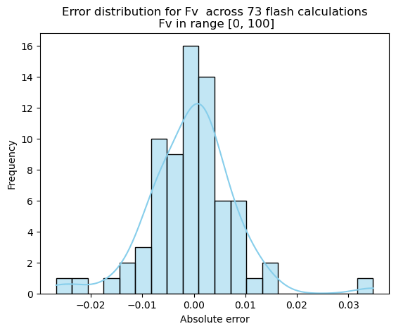
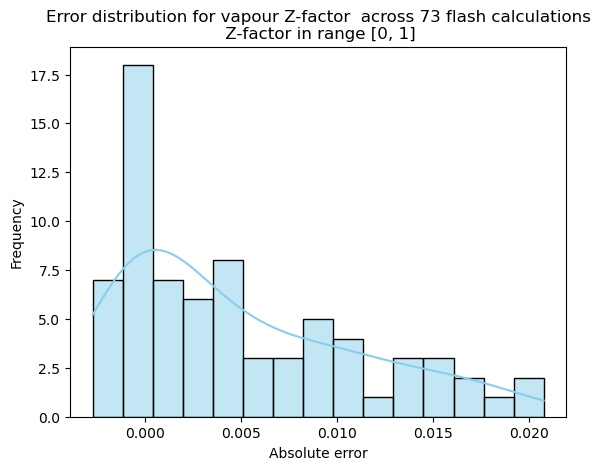
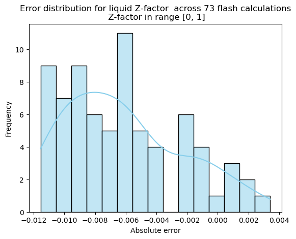
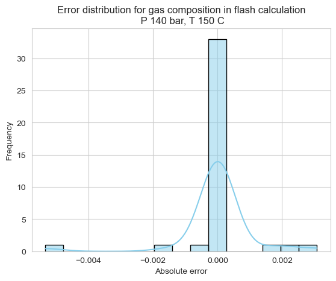
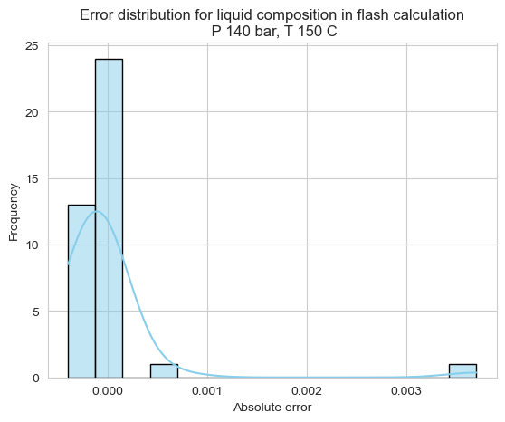
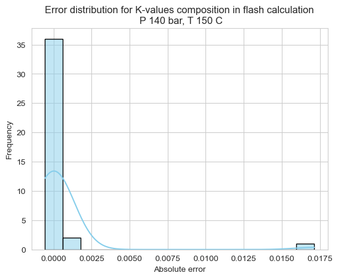

# Python PVT сompositional modeling  #

Fluid compositional modeling with use of EOS

## Description ##

This package is the result of a study into compositional fluid modeling and is being actively expanded and developed.

* View [nootebook](https://github.com/SidorenkoDD/BlackBoxFluid/blob/main/code/exmp_notebooks/exmp_how_to_use.ipynb) how to use this package

* View [modules description](https://github.com/SidorenkoDD/BlackBoxFluid/blob/main/MODULES.md)

``The author strives to avoid errors in the calculation modules, but does not guarantee their absence``.

## PVTSim comparison ##
View [notebook](https://github.com/SidorenkoDD/BlackBoxFluid/blob/main/code/exmp_notebooks/exmp_pvtsim_comparison.ipynb) with comparison

### Two phase flash
#### Fv ####

#### Z-factor ####
 

#### Compositions ####
Comparison of phase compositions and k-factors for P=140 bar, T = 150 C 

## Abilities ##

* Creation of a composition up to C45
* Conducting a two-phase equilibrium stability analysis at given PT conditions
* Conducting a flash calculation at given PT conditions
* *Phase diagram construction - in progress*

### Experiments ###
#### PVT Routine Simulation ####
* Saturation Pressure
* Standard Separation
* Separator Test
* *Differential Libration - in progress*
* *Constant Mass Expansion - in progress*

## Modules ##

### EOS ###
* Peng-Robinson Peneloux
* SRK
* *Brusilovsky EOS -  in progress*

###  С6+ properties correlations  ###

#### P critical ####
* Kesler - Lee
* Rizari - Daubert
* Pedersen
* Standing

#### T critical ####
* Roess
* Nokey
* Cavett
* Kesler-Lee
* Pedersen
* Standing

#### Critical volume ####
* Rizari - Daubert
* Hall - Yarborough

#### Acentric factor ####
* Edmister
* Rizari - Al-Sahhaf

#### Shift Parametr ####
* Jhaveri-Youngren

#### BIPS ####
* Chueh-Prausnitz
* Zero

