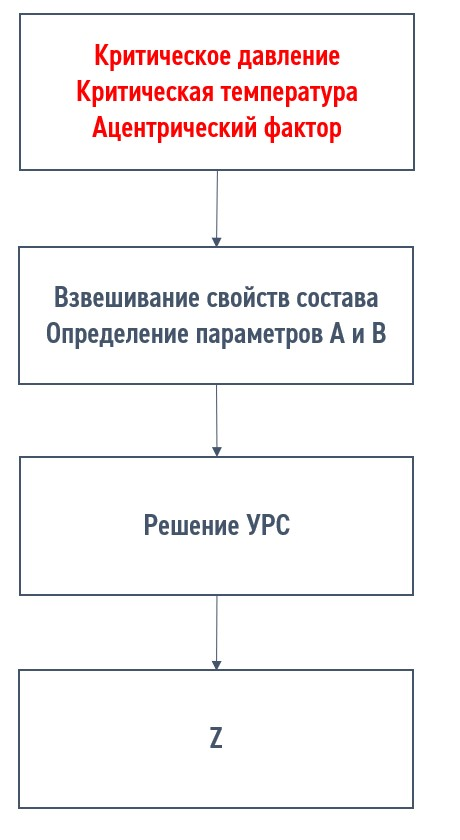

# Введение
PVT-модель углеводородной смеси является основополагающей для моделирования процессов фильтрации, подъема флюида в скважине, транспортировке в системе сбора, подготовке и переработке нефти. **Адекватное воспроизведение физических свойств и компонентного состава фаз в зависимости от термобарических условий по результатам лабораторных исследований - основная задача PVT-моделирования в различных областях нефтяного инжиниринга**. ~~Ошибка в PVT-модели влечет за собой некорректное прогнозирование и интерпретацию инженерных расчетов~~.

        В процессе развития PVT-моделирования с середины XX века эксперты предложили и развили достаточное количество подходов к адаптации PVT-моделей на основе двух- и трехпараметрического уравнения состояния Peng-Robinson, описанные в работах[]. На сегодняшний день в периметре компании активно используется алгоритм, предложенный авторами[ТС и АИ].

Использование уравнения состояния (УРС) для многокомпонентной смеси подразумевает осреднение различных свойств индивидуальных компонент (критические свойства, ацентрический фактор, шифт параметр), используемых в решении УРС. В результате УРС Peng-Robinson сводится к виду:

$$
\left\{
\begin{aligned}
a_{i} &= \Omega_{a}\frac{T_{c}^2 R^2}{p_{c}} \\
b_{i} &= \Omega_{b}\frac{T_{c} R}{p_{c}} \\
A_{i} &= a_{i}\frac{p}{(RT)^2} \\
B_{i} &= b_{i}\frac{p}{RT} \\
A &= \sum_{i}\sum_{j} z_{i}z_{j}\sqrt{A_{i} A_{j}} (1-k_{ij}) \\
B &= \sum_{i} z_{i}B_{i} \\
Z^3 - (1-B)Z^2 &+ (A + 3B^2 - 2B)Z - (AB - B^2 - B^3) = 0
\end{aligned}
\right.
$$

